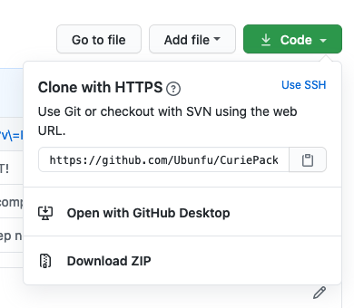

# CuriePack
Curie House Minecraft Resource Pack.  For Minecraft Java Edition.

### Install
1) Locate your minecraft client's installation directory.
      * Windows Default: `%appdata%\\.minecraft`
      * Mac OS Default: `~/Library/Application Support/minecraft`
      * Linux Default: `~/.minecraft`
  
2) If it does not exist, create a directory called "resourcepacks" under your client's install directory. 
   
3) Download the entire pack directory to the client install directory.
   1) `git clone https://github.com/Ubunfu/CuriePack.git`
   
      OR
   2) Click the green button and download a zip.
      
      
6) Open your launcher and run minecraft.

7) Click the "Options..." button from the title menu.

8) Click the "Resource Packs" button.

9)  You should see "CuriePack" in the available resource packs list on the left. Click the arrow that will appear over the icon to enable it.

10) Click "Done" to reload your resource packs.

11) Play minecraft.